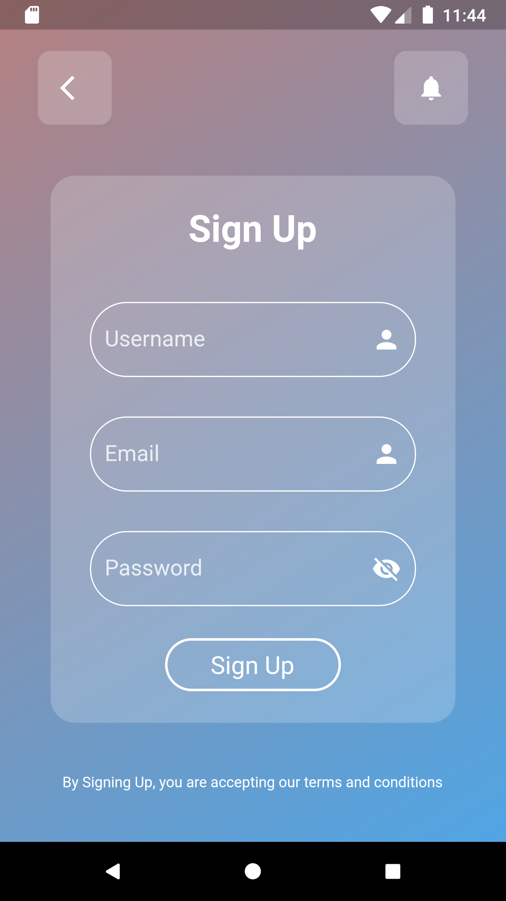
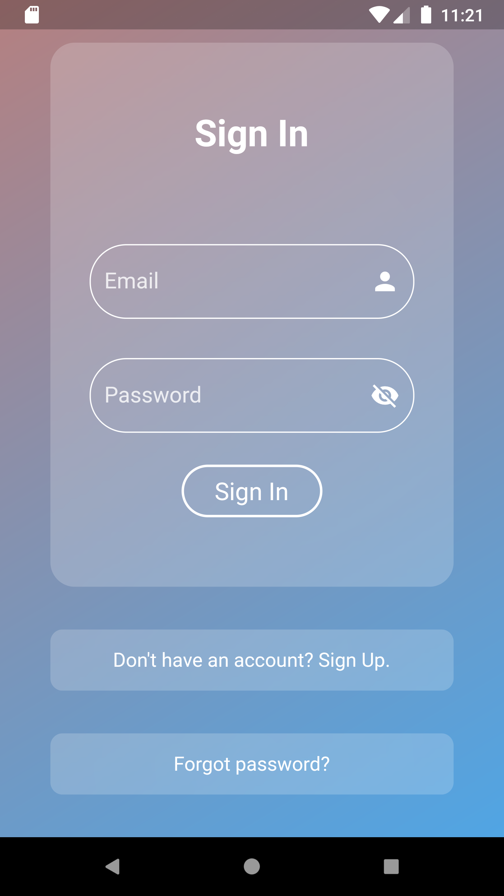
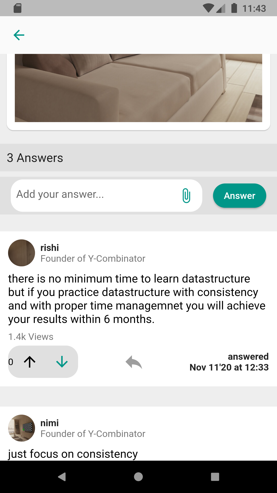
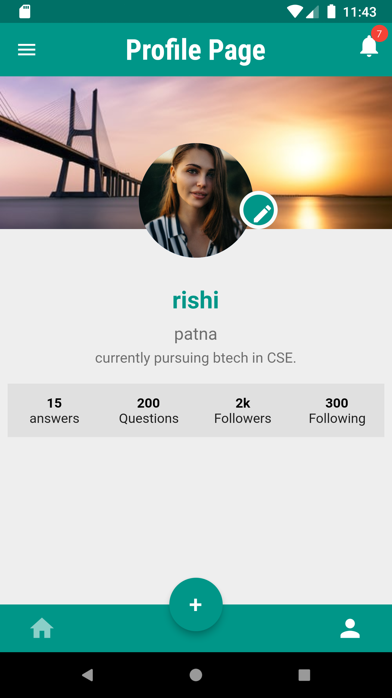

# Questry

Social App for students to help solve their Doubts.

## Download The Android APK

<a href="https://drive.google.com/file/d/1hO3oUHbe0YRpfw0hlvU7uXB0nxgophG0/view?usp=sharing">Click Here To Download</a>

## Screenshots

## Login & SignUp

  </img>
  </img>
  </img>

## Posts Features

</img>
  </img>
  </img>
  

  
## user Profile

  </img>
   </img>
  

  
 ## Messaging Feature
 

  </img>
   </img>
   </img>
  

## Dependencies
`get: ^4.1.4`\
`http: ^0.13.3`\
`flutter_secure_storage: ^4.2.0`\
`image_picker: ^0.8.1+1`\
`socket_io_client: ^1.0.2`\
`shared_preferences: ^2.0.13`\

## Tools Used
1. Framework - Flutter
2. Language - Dart
3. Database - MongoDB
4. Backend -Nodejs
5. IDE - Visual Studio Code
6. Version Control - Git

## To use this app follow below instructions-:

### Step 1:
Clone this app using below syntax -:

`git clone https://github.com/DevStack06/Flutter-Blog-App.git`

### Step 2:
After cloning install packages using below syntax -:

`flutter pub get`

Above command will install all the necessary packges.

### Step 3:
Run the app on your mobile using below command -:

`flutter run`
